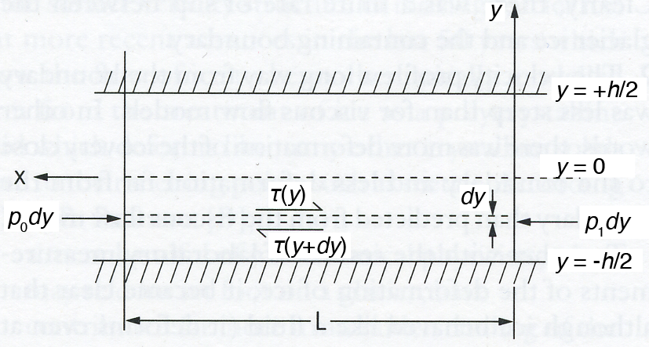

#Theory for Exercise 5, problem 1
 
*Figure 1. Schematic diagram of pressure-driven flow in a channel.*

The viscosity of ice depends on both temperature and stress. For simplicity, we’ll consider the case where viscosity is only a function of shear stress. Consider a channel of width *h* centered about *y* = 0, with lateral boundaries at *y* = ±*h*/2 (Figure 1). A pressure gradient *Δp* = *p*1 - *p*0 drives flow within the channel of length *L*.  The shear stress in the fluid depends on the applied pressure gradient and the distance from the channel boundaries

where *τ* is the shear stress. We know that for Newtonian fluids

where *η* is the dynamic viscosity of the fluid. Substituting the right side of Equation 2 into the left side of Equation 1 we find

Integrating Equation 3 twice we get

Since we know *du*/*dy* = 0 at *y* = 0, we find *c*1 = 0, and because we assume zero slip at the boundaries of the channel (*u* = 0 at *y* = ±*h*/2), *c*2 = (1/2*η*)(*dp*/*dx*)(*h*/2)2. Thus,
