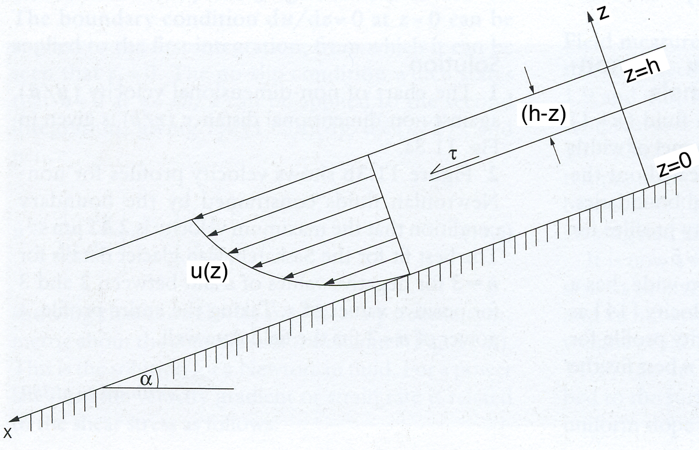

# Theory for Exercise 5, problem 2
 
*Figure 1. Schematic diagram of a viscous fluid flowing down an inclined plane.*

The velocity of a fluid flowing down an inclined plane can be modelled using some basic physical relationships. First, recall that the basal shear stress for a fluid flowing down an inclined plane is due to the down slope component of the weight of the overlying fluid

&nbsp;&nbsp;&nbsp;&nbsp;&nbsp;&nbsp;&nbsp;&nbsp;**[Eqn. 13]**

where *ρ* is the fluid density, *g* is the acceleration due to gravity, *h* is the thickness of the fluid perpendicular to the inclined plane and *α* is the angle of the plane with respect to horizontal. At any distance *z* above the bed

&nbsp;&nbsp;&nbsp;&nbsp;&nbsp;&nbsp;&nbsp;&nbsp;**[Eqn. 14]**

where *γ**x* = *ρg*sin(*α*) is the downslope component of the gravitational force. Combining [Equation 2 from Part 1 of the theory](Exercise-5-theory-1.md) with Equation 14 we find the constitutive equation for a Newtonian fluid is

&nbsp;&nbsp;&nbsp;&nbsp;&nbsp;&nbsp;&nbsp;&nbsp;**[Eqn. 15]**

Integrating Equation 15 yields

&nbsp;&nbsp;&nbsp;&nbsp;&nbsp;&nbsp;&nbsp;&nbsp;**[Eqn. 16]**

where *c*1 = 0 from the boundary condition *u* = 0 at *z* = 0. Equation 16 can be rewritten as

&nbsp;&nbsp;&nbsp;&nbsp;&nbsp;&nbsp;&nbsp;&nbsp;**[Eqn. 17]**

For a non-Newtonian fluid, Equation 14 can be modified to account for the case where the strain rate varies as a power of the shear stress ([Equation 7 from Part 1 of the theory](Exercise-5-theory-1.md))

&nbsp;&nbsp;&nbsp;&nbsp;&nbsp;&nbsp;&nbsp;&nbsp;**[Eqn. 18]**

To determine the velocity profile, we need to integrate Equation 18. If we use the boundary condition that the basal sliding velocity is equal to ub rather than zero, we get

&nbsp;&nbsp;&nbsp;&nbsp;&nbsp;&nbsp;&nbsp;&nbsp;**[Eqn. 19]**
